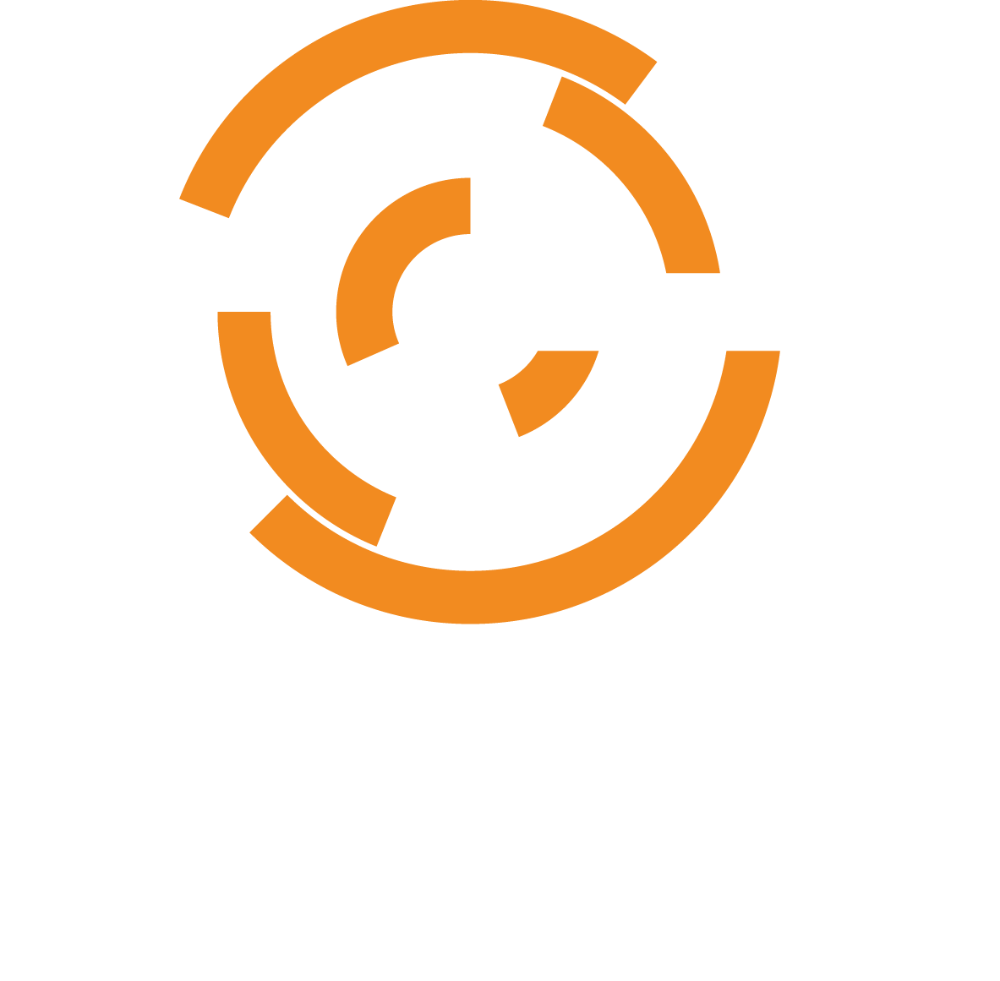

autoscale: true
# Managing Your Mental Stack

---

## whoami

@mattstratton

^ This talk was inspired by an episode of Arrested DevOps that we did back in March of 2014 on this topic. I wanted to explore this further.

---

# [fit] Information Overload

^ We are inundated with information today. Data and ideas are coming at us like a firehose, through things like social media, blogs, news channels, etc. 

^ If you're someone here at a DevOpsDays, you are likely a curious person. You want to know more. You might even be addicted to learning more, like I am. 

^ Jefferey Snover of Microsoft said once that if you don't want to have to learn new things, go into lumber. we've learned most of what there is to know about wood. It doesn't change. But technology is constantly changing, and we feel pressure to keep up with this flow of information, both because of a need to stay industry relevant, and also because of our personalities.

---

^ Just doing our job requires us to keep up to date. There are new frameworks and tools every time you turn around. You hear about this "Docker" thing, and all of a sudden you want to know about it. You might not even know if you need to know about it, or if you'll care once you do...but it's exciting, everyone's talking about it, and you don't know even what it is. 

---

# [fit] Podcasts

^ I'm a podcast junky. Podcasts are great ways to learn new ideas and get exposed to things. And all of a sudden, because of NPR and Serial, everyone cares about them again. Depending upon your style, a podcast (or more than one podcast) can be a great way to absorb information.

^ Good for concepts; less good for deep details

---

Listening to podcasts is a terribly inefficient way of transferring actual information.  It's a bit like asking Grandpa Simpson for directions. It takes 45 minutes, consists mostly of historical inaccuracies and long rants about the messed up state of the world today, and at the end you're not really sure you aren't more lost than when you started.  But it sure is entertaining.

-- John Smyth, the "Ron Swanson of DevOps"

^ This is something John said to me when I was trying to teach him some new stuff. He was joining a company where I worked, and hadn't worked with Chef, or DevOps, or a lot of the tech we used. I gave him a long list of resources to check out, which included some great blog posts, some books, etc, and also a bunch of podcasts. And this is what his response was.

---

### Podcast Pro Tip

## Listen at 2x speed

^ You might need to tweak the speed you listen to it at (2x might be too fast for you), but since we have discussed that podcasts are for absorbing information and concepts, and not specifics, you really can blast through them. 

^ Depending on how you listen to podcasts, too, they don't always get your full attention. If you listen to a podcast while you're driving, I sure hope you're NOT hanging on every word. You might even have a podcast going in your headphones while you're doing a mundane task. This plays into my next point which is...

---

## Absorb Ideas First

### Understand them later

^ This avoids the "rabbit hole", and lets you focus and re-prioritize things that you want to go deep on. You may hear of a concept on twitter, and not fully understand it, but make a note to dig into it deeper when it is more appropriate. I'll talk later on about some specific ways to accomplish this. But the idea isn't to totally understand it, but to let it wash over you and sink in over time, until you are in a place to be able to synthize it. 

---

# Decide what is worth learning

^ If you only learn things from projects you are assigned, you are limited in what you can discover

---

# [fit] Avoid the echo chamber

^ Very easy to only read/listen to people who agree with us (this is true outside of tech too)
If you're a Windows person, read /r/linux sometimes. Just stay away from the comments. Never read the comments.

---

# Investigate

^ This is more than just different kinds of technology. This can include things like business models (starting with the business your company is in), science in general, and if you do learn different kinds of tech, hey, empathy, right?

---

# Learn

^ The first stage in our cycle is learn. This is where we are starting to understand the concept or technique we want to use. This might be reading an article about it, it might be re-listening to an episode of a podcast, or just reading book or an article in a magazine. this is where we are being "academics" and more focused on theory.

---

# Do

^ You need to try it. Implement something with it. Even if it's a throwaway. You want to learn Chef, write some Chef code. Even if it's just an experiment to do something silly, that's not for work, try it. Practice makes perfect, and putting your hands on the keyboard, for example, will let you do two things. One, see if this is something that actually resonates with you beyond the theory, and two, strengthens the neural pathways of your understanding.

^ this isn't just about trying out some type of code. If you want to learn about a style of communication, actually try it. Try it a lot. Practice. Try it in different ways. 

---

# Teach

^ Teaching can be more than just explaining it to someone else. A really useful trick is to write a blog post about this. Even if you think that someone else has already written a post about it, and nobody will ever read yours, the excercise of writing it will cement the knowledge in a different manner for you.

^ If you're really not into blogging, or the topic is one that needs to stay private, I am also a big fan of "personal wikis" - you can use a tool like Evernote for this, or VoodooPad

---

# Howto

^ Getting down to actual implementation of some of these ways of absorbing and consuming the information now. 

---
# Ingest articles in "skim mode"

- Twitter
- Fliboard
- RSS feeds

^ As tempting as it is, in this mode, don't read for detail. Skim enough to get the gist to figure out if the author seems to be providing content worth reading (is it a buzzfeed style listicle, or more in depth information, etc). You want to just identify enough that this particular piece of content has piqued your interest for follow up. 

---
# Ship them into temporary storage

- Pocket
- Instapaper
- Plain old bookmarks

^ I don't really care HOW you do it; I personally use Pocket because it's cloud-based and it works with my favorite apps (I can save things to Pocket from Chrome on my desktop, mobile Safari on my phone, and from Flipboard and Tweetbot). I'm not saying it has to be fancy, either. You just might have a "read it later" set of bookmarks. The trick is to make it EASY. You can't have to spend more than a few senconds pinning something into your "read it later" area.

---
# Read them later

^ Do this at a scheduled time. Maybe you know you have a train ride and you can focus on it. But the important part is that you are able to focus and not be distracted. If you are a fan of the Pomodoro technique, you can use this for both your reading time or your skimming time.

---

# What are your tips?

---

# Resources

- Flipboard - [http://flipboard.com/](http://flipboard.com/)
- Pocket [http://getpocket.com/](http://getpocket.com/)
- Pomodoro Technique [http://en.wikipedia.org/wiki/Pomodoro_Technique](http://en.wikipedia.org/wiki/Pomodoro_Technique)
- VoodooPad [https://plausible.coop/voodoopad/](https://plausible.coop/voodoopad/)
- Arrested DevOps: Managing Your Mental Stack [http://www.arresteddevops.com/managing-your-mental-stack/](http://www.arresteddevops.com/managing-your-mental-stack/)

